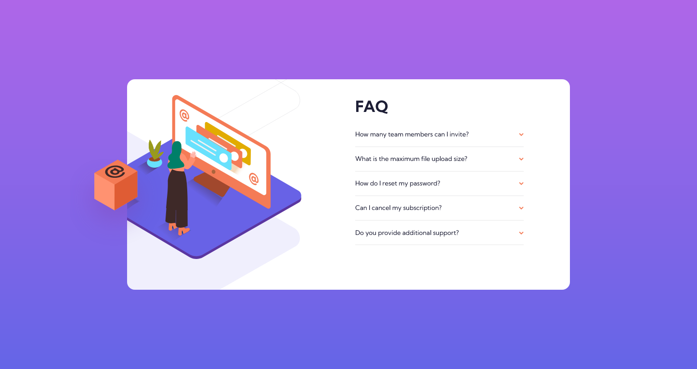

# Frontend Mentor - FAQ accordion card solution

This is a solution to the [FAQ accordion card challenge on Frontend Mentor](https://www.frontendmentor.io/challenges/faq-accordion-card-XlyjD0Oam). Frontend Mentor challenges help you improve your coding skills by building realistic projects.

## Table of contents

- [Overview](#overview)
  - [The challenge](#the-challenge)
  - [Screenshot](#screenshot)
  - [Links](#links)
- [My process](#my-process)
  - [Built with](#built-with)
  - [What I learned](#what-i-learned)

## Overview

IMPORTANT - I've paused this design for the time being but there are some major improvements that should be added in my opinion. They're as follows,

- The box in the design is added as ::after of the body as a quick solution to achieve the design. This will defintely create responsive issues.
- This was done due to the fact that the image wasn't contained in it's own parent div where I could set an overflow:hidden to the parent. Because of this I had to do the overflow:hidden on the card itself which prevented me from adding an ::after or ::before on the card to get the hover box effect as whatever that was out of the card was hidden by default.
- Adding the parent div on the image completely changed the spacing I had created thus making the modification will be time consuming.
- Add a height to the accordian
- The accordian needs a height to have a smooth animation effect. This should be done with JS where the height of the accordian child is taken and the height style is set within JS. Will probably require a rework of the entire accordian solution and will have to move away from the toggle that's currently in place.

### The challenge

Users should be able to:

- View the optimal layout for the component depending on their device's screen size
- See hover states for all interactive elements on the page
- Hide/Show the answer to a question when the question is clicked

### Screenshot

### Links

- Solution URL: [https://github.com/chucksterv/faq-accordion-card]
- Live Site URL: [https://faq-accordian.projects.deshand.com]

## My process

### Built with

- Semantic HTML5 markup
- CSS custom properties
- Flexbox
- CSS Grid
- Mobile-first workflow
- SASS
- BEM

### What I learned

- That transition animations tend to be clunky when the height is set to auto instead of setting a set height
- That there is a toggle method in javascript to easily add and remove classes
- That setting an overflow:hidden will effect the parents pseudo classes, ::before and ::after
